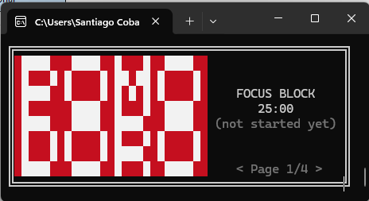
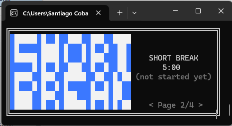
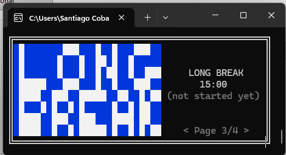
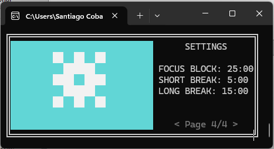

# 
A Pomodoro timer for CMD!

# Features
- Pomodoro, Break and Long break timers!
- Custom times!
- Always on top!

Yeah that's about it... There's not much to this app, other than it's made for CMD...

# Usage
- Start or pause timers with "SPACE"
- Move through pages with "ARROW KEYS"

Things to note:
- Moving to another a page will restart the timers
- You cannot move to another page if there's an ongoing timer
## Default arguments
Use
```
    CommandTomatoes.exe
```
From CMD, and voila!

## Custom time
Use
```
    CommandTomatoes.exe -h
```
for more information.

Yeah, this is a really simple app, huh... Well, here's some screenshots!

# Screenshots
## 
This is the pomodoro page!

## 
Short break page!

## 
Long break page!

## 
The settings page! You can't really change any settings from here, it'll just show you the default time's you've set.

# Installation
This app is only available for **Windows**, as I don't have the resources or tools necesary to build for Linux/MacOS.

To download this software, go to [the releases page](https://github.com/Aquaticsanti/CommandTomatoes/releases/latest) and download *CommandTomatoes.exe*!

# Building
To build this, use PyInstaller!

First, clone the repo
```
git clone https://github.com/Aquaticsanti/CommandTomatoes.git
```
Then, *cd* into the repo, and run
```
pyinstaller CommandTomatoes.spec
```
And done! The CommandTomatoes executable will be in your *dist* folder!

